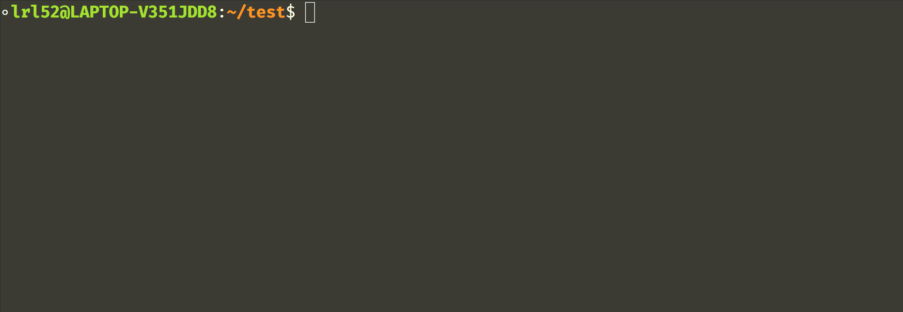

## 编译原理实验 Lab2——递归下降分析法

> 笔者的程序不会回溯，使用了一点人类智慧来预测接下来应该进入的分支，保证每次进入的分支都是正确的，因此可能不完全是递归下降分析法

实验环境：Ubuntu-22.04，请提前安装好 `flex, gcc, g++, make` 构建工具

程序的输出严格遵循 clang 生成的语法树(ast)，略去了部分 `sysy` 文法中没有的信息，例如 `ImplicitCastExpr`。clang 生成 `xxx.c` 的语法树(ast)的参考命令：

```sh
clang  -fsyntax-only -Xclang -ast-dump xxx.c
```

### 项目构建：

```sh
make
```

构建后会产生 `main`（递归下降分析程序）， `scan`（词法分析器，可用于 Debug ）和 `test` （测试脚本程序）

### 程序测试：

```sh
./test
```

所有测试结果会存放在 `./test_cases_output` 中

注：确保输入用例的词数不超过 `MAXN`（默认为 100005，定义在 `main.c`中 ），文法符合 `sysy.y` 中的产生式


